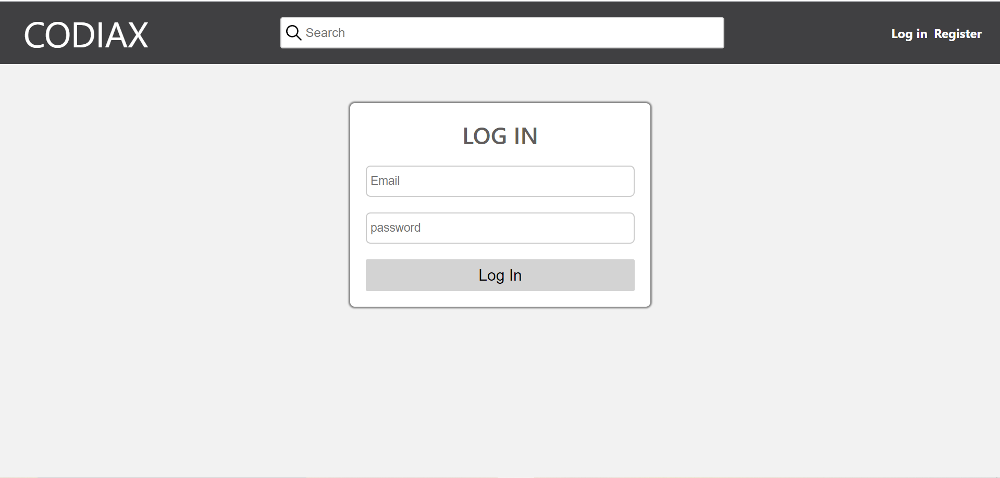
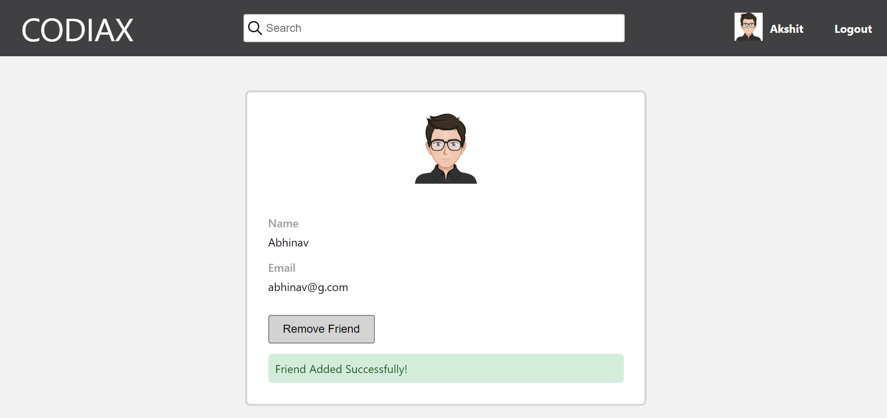
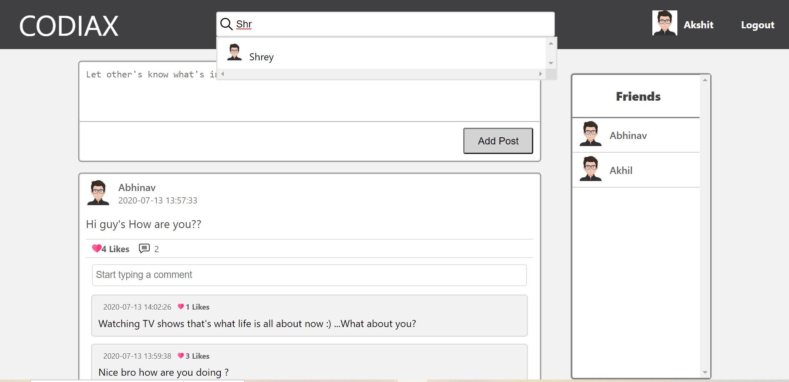
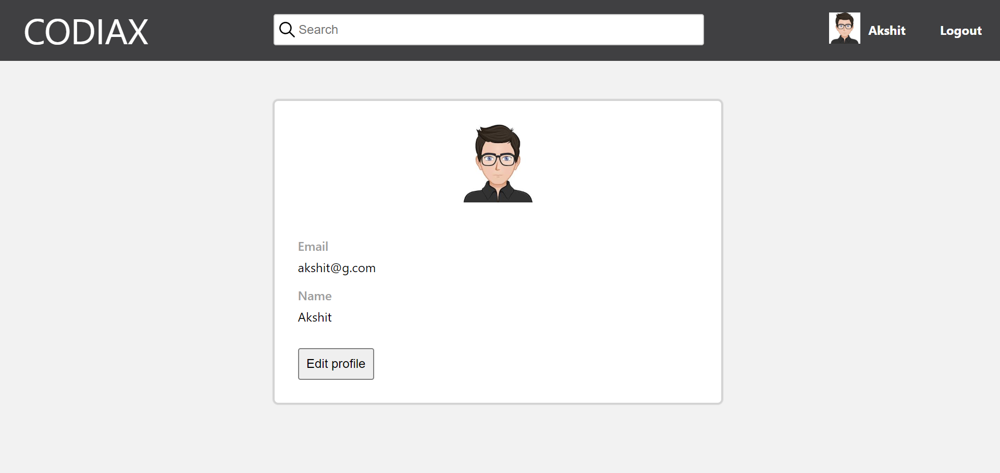
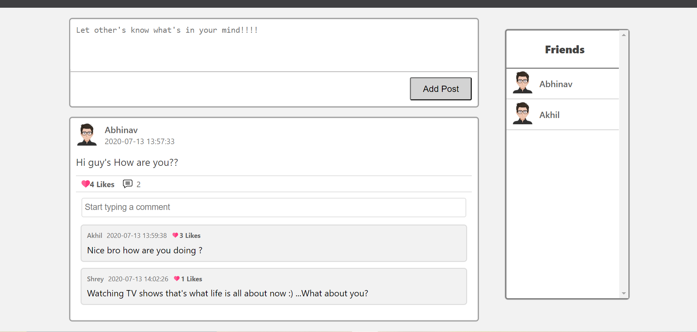

 ## CODIAX
CODIAX is a WebApp where you can add your own Posts, Comment on other's post, Like other's Posts/Comments, Add/Remove your friends etc.

In order to run the Codiax Project you need to clone the Codiax-Backend repository that contains all the API's which are required for the Codiax Project.

## Run Instructions For Codiax:- 
<ul>
  <li>Clone the repository https://github.com/akshitgarg4/Codiax-Backend.</li>
  <li>Use command npm install to download the dependencies. </li>
  <li>Give command nodemon index.js that will start the backend server.</li>
</ul>

<ul>
  <li>Then clone the above repository</li>
  <li>Use command npm install to download the dependencies. </li>
  <li>Give command npm start that will automatically load the Home Page of CODIAX in your browser.</li>
</ul>

## Key Features:-
<ul>
  <li> SignUp/Login to create your account. </li>
  
  
  
  <li> Add / Remove friends from your Friends List. </li>
  
  
  
  <li> Search for your friends from all the User's available. </li>
  
  
  
  <li>Edit your Profile</li>
  
  
  
  <li>Post or Like/Comment on other's Posts.</li>
  
  
